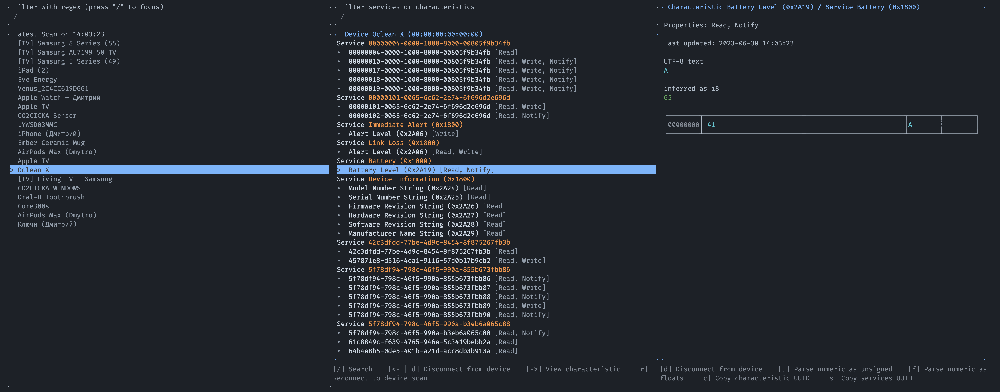

<p align="center">
<picture>
  <source media="(prefers-color-scheme: dark)" srcset="./dark.png">
  <source media="(prefers-color-scheme: light)" srcset="./light.png">

  
</picture>
</p>


<p align="center">
 <a href="https://twitter.com/goose_plus_plus">
   
 <a href="https://crates.io/crates/blendr">
 <a href="https://crates.io/crates/blendr">
     
 </a>
 <a href="https://github.com/dmtrKovalenko/blendr/blob/main/LICENSE">
   
 </a>
</p>


Blendr is a terminal UI app for browsing BLE (Bluetooth Low Energy) devices. It allows you to inspect, search, connect, and analyze data coming from BLE devices directly from your terminal.

It was designed for day-to-day use by BLE engineers so the core features are **useful search**, direct connection to any characteristic and device with **one command**, and displaying **your custom services names** in the UI. [Learn more](#usage)

<p align="center">
  
</p>

And it's just perfect to hack your neighbor's toothbrush 😉 

## Installation 

Cargo cli

```
cargo install blendr --locked
```

For Unix OS you can run the following, it will install the binary for your system and provide man reference.

```
curl --proto '=https' --tlsv1.2 -sLSf "https://github.com/dmtrKovalenko/blendr/blob/main/install.sh?raw=true" | sh
```

For windows, it is required to download and run binary executable directly. Open [latest release](https://github.com/dmtrKovalenko/blendr/releases/latest) page and download binary executable for your OS

### MacOS Permissions

To use Bluetooth on MacOS Big Sur (11) or later, you need to enable the Bluetooth permission for your terminal. You can do the latter by going to System Preferences → Security & Privacy → Privacy → Bluetooth, clicking the '+' button, and selecting 'Terminal' (or iTerm or whichever terminal emulator app you use).

<p align="center">
  
</p>

## Usage 

Get the help information with either `man blendr` or `blendr --help` it will print all the available options and characteristics. To get started and learn about the biggest features watch this 2 minutes demo: 

<a href="https://youtu.be/5lRjzPYj0uE">
  <p align="center">
      
  </p>
</a>

## License 

This project is licensed under the terms of BSD-3-Clause license

